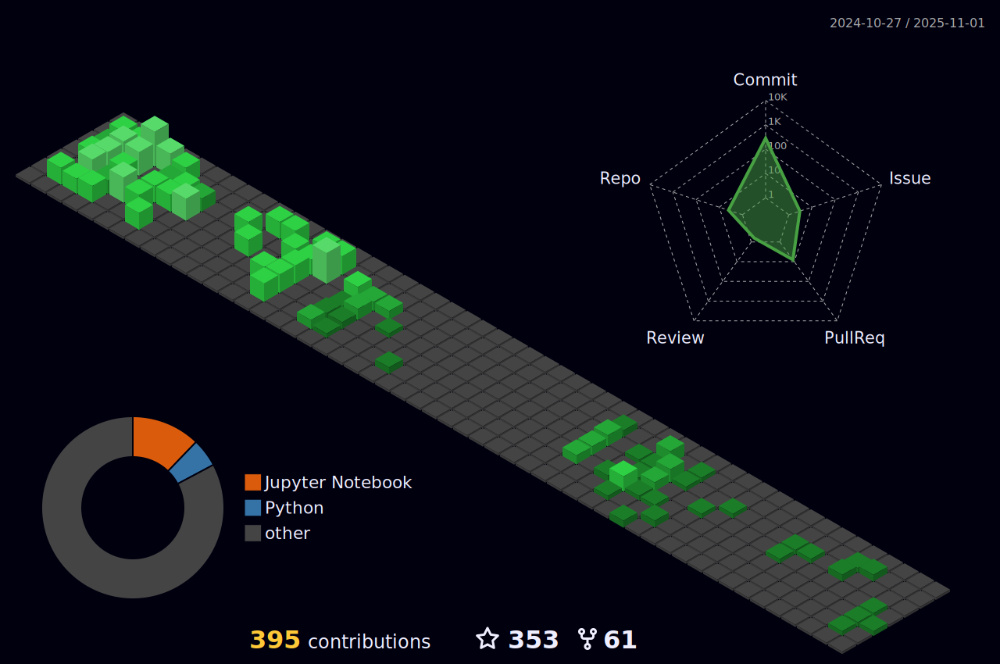

### Hi there 👋 This is Gema!

- 🔭 I’m currently working on Data Science and Machine Learning
- 🌱 I’m currently learning advanced Python and AI Alignment.
- 📫 How to reach me: at twitter @SoyGema

Portfolio

+[Dice Game Probability exercise](https://github.com/SoyGema/Portfolio/blob/main/DataExploration/Dice_Game_Probability.ipynb) In this exercise you can see more about how I structure code and solve some probabilistic questions taking into account a Dice-Game. Find the challenge description [here](https://github.com/SoyGema/Portfolio/blob/main/DataExploration/README.md) and code above.

+[Data Exploration Squirrels Dataset](https://github.com/SoyGema/Portfolio/blob/main/DataExploration/Exploratory%20Analysis.ipynb) General Data Science exploration : In this exercise you can see more about how I think from an analytical perspective and which tools I use for data exploration.

Open Source Tutorials

+[StarCraft 2 Codelab](https://soygema.github.io/starcraftII_machine_learning/#0) In this project I've created a codelab to share with the community some of the machine learning fundamentals I've learnt about open source research with StarCraft 2 DeepMind project.

+[Satellite orbit prediction with DVC VSCode Open Source extension](https://github.com/iterative/VSCode-DVC-Workshop) Workshop given at PyDayBCN 2022. In this workshop we predict kinematic orbit for 600 Satellites making machine learning experiments with Multioutput Random Forest Regressor.  

Research Projects

+[NeuRIPS 2020](https://cupdf.com/document/benchmarking-imitation-and-reinforcement-learning-for-.html?page=1) Participation in NeuRIPS 2020 Workshop WordPlay: When language meets games with the videogame Mempathy. This projects benchmarks some experiments with Imitation and Reinforcement Learning in language oriented games.

+[ICML 2021](https://docs.google.com/presentation/d/1iATyd80yYMKoV-WPzV0_hYntYbpwvlZS/edit?usp=sharing&ouid=109726716116488916327&rtpof=true&sd=true) Poster session in WiML Unworkshop. 

Machine Learning and videogames blogposts

+[StarCraft II Unplugged](https://medium.com/p/1c9192fc03b) BlogPost about latest developments released by Deepmind at NeuRIPS2021 DRL workshop. It includes figures and videos made to interpret and communicate papers results.

+[Interactive Narrative control : safety and aligment of language agents](https://medium.com/p/2be8eb7636a9) Technical blogpost article about PPLM research implementation for Mempathy.

Recent activity

<!--START_SECTION:activity-->

53. Comment on issue [#4919](https://github.com/iterative/dvc.org/issues/4919)
54. Comment on PR [#9606](https://github.com/iterative/dvc/pull/9606#issuecomment-1773055937)
55. Read OSS [paper](https://arxiv.org/pdf/2311.16989.pdf)
56. Comment issue [#1493](https://github.com/ydataai/ydata-profiling/issues/1493#issuecomment-1839773478)
57. Comment isue [#5104](https://github.com/iterative/vscode-dvc/issues/5104)
58. Read OSINT [paper](https://link.springer.com/article/10.1007/s10462-023-10454-y)
59. Read AI OSS [paper](https://papers.ssrn.com/sol3/papers.cfm?abstract_id=4596436)

   
   
Historical activity can be found [here](https://github.com/SoyGema/OSS_activity/tree/main)
   

   
<!--END_SECTION:activity-->

 

Graph
   
   

 
